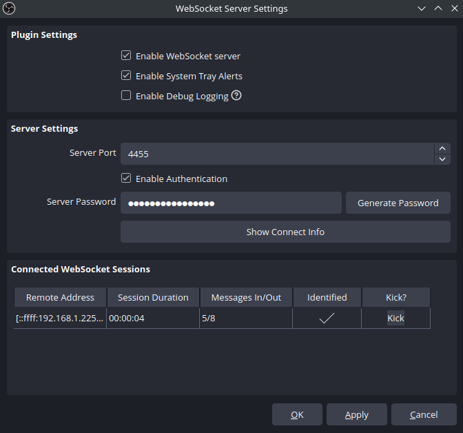

# OBS Control API
Clipping made easy!
---

RUMBLE mod that allows controlling OBS Studio from inside of the game. 

This mod implements a websocket client that communicates directly with OBS and allows controlling it from inside the game, without the need for third-party software. It provides:
- for modders, an API to easily send requests and subscribe to events
- for users, two default controller key bindings that facilitate clipping:
    - pressing both buttons on the left controller
    - pressing both buttons on the right controller

The client connects automatically as soon as the server (ie OBS Studio) is available. If the server is unavailable, it will keep trying to contact it every 3 seconds. If it connects but fails to authenticate (wrong password), it will disconnect, log an error message and stop trying until the options in ModUI are changed.

## Requirements
In addition to the displayed dependencies, this mod requires the **obs-websocket** plugin, which is included by default with **OBS Studio 28.0.0 and above**. For older versions, you need to install the plugin manually.

## Setup
1. After starting the game with the mod and loading into the gym, you should be able to edit the options in ModUI by pessing **F10**. This needs to be done on the first time you use the mod, in order to configure the websocket client.

2. Open OBS Studio and go to **"Tools"->"WebSocket Server Settings"**. There, check **"Enable WebSocket server"**:

    
    
    After that, use the server's configuration to configure the mod:
    - Copy the password and enter it into ModUI.
    - The IP address of the server only needs to be entered if you're running OBS and the game on different computers. Else you can leave the default value "localhost".
    - By default, the websocket server is operating on port 4455. If you didn't change it manually then you shouldn't need to change it in ModUI.

    Once you save the configuration, the mod will try to connect again, and if it's successful you should see it under "**Connected WebSocket Sessions"**.

3. Other options you can set in ModUI are:
    - do you want the mod to start the replay buffer automatically as soon as it connects to OBS (highly recommended)?
    - what do you want the two default key bindings to do? The options are:
        - Nothing
        - Save replay buffer
        - Start recording
        - Stop recording
        - Toggle recording
    - do you want a haptic feedback every time the recording state changes? This includes:
        - recording started
        - recording stopping
        - replay buffer saved

The **default configuration** is set to automatically start the replay buffer when the client connects, save the replay buffer when the two buttons on the left controller are pressed (no binding for the right one), and it will give haptic feedback as confirmation that the clip was successfully saved.

## Modding API
The mod provides 3 types of programming interfaces:
- **Local functions** that don't create new requests
- Sending **requests** to OBS (and receiving the responses)
- Subscribing to **events** from OBS

All classes, functions and types are defined in the namespace `OBS_Control_API`.

All of the methods and events are provided inside of a single public class named "OBS", so all of the following definitions are assumed to have the prefix `OBS.` before them. For example, to save the replay buffer, you need to call the appropriate static method:
```c#
OBS.SaveReplayBuffer();
```

**<details><summary>Local functions</summary>**

Most of these functions are here to remove the need to create a new request for information that is already tracked by the mod, like the recording status for example.

#### bool IsConnected()
Returns true if the client is connected to OBS, ready to send requests and receive events.

#### bool IsReplayBufferActive()
Returns true if the replay buffer is active.

#### bool IsRecordingActive()
Returns true if recording is active.

#### bool IsStreamActive()
Returns true if streaming is active.

#### void Connect()
Forces the mod to open a websocket connection. If it was already connected, the old connection is killed and a new one is initiated.

#### void Disconnect()
Forces the mod to close the websocket connection. The mod will not attempt to reconnect by itself.

#### void HapticFeedback(float intensity, float duration)
Execute a haptic impulse on both controllers. Can be used to implement your own haptic feedback for various events.

</details>

**<details><summary>Requests</summary>**
The request functions are blocking operations that both send the request and wait for the response. We have two types of requests:
- those that return a specific response return a predefined structure that is specific to the request type. If the request fails, they return `null`.
- the other ones return a boolean: `true` if successful, `false` if failed.


#### RequestResponse.GetReplayBufferStatus GetReplayBufferStatus()
Fetches the current status of the replay buffer.
```cs
public class GetReplayBufferStatus
{
    public bool outputActive { Get; Set; }
}
```

#### RequestResponse.GetRecordStatus GetRecordStatus()
Fetches the current recording status.
```cs
public class GetRecordStatus
{
    public bool outputActive { Get; Set; }
    public bool outputPaused { Get; Set; }
    public string outputTimecode { Get; Set; }
    public int outputDuration { Get; Set; }
    public long outputBytes { Get; Set; }
}
```

#### RequestResponse.GetStreamStatus GetStreamStatus()
Fetches the current streaming status.
```cs
public class GetStreamStatus
{
    public bool outputActive { Get; Set; }
    public bool outputReconnecting { Get; Set; }
    public string outputTimecode { Get; Set; }
    public int outputDuration { Get; Set; }
    public float outputCongestion { Get; Set; }
    public long outputBytes { Get; Set; }
    public int outputSkippedFrames { Get; Set; }
    public int outputTotalFrames { Get; Set; }
}
```

#### RequestResponse.GetVersion GetVersion()
Fetches the version of OBS and the negociated protocol parameters.
```cs
public class GetVersion
{
    public string obsVersion { Get; Set; }
    public string obsWebSocketVersion { Get; Set; }
    public int rpcVersion { Get; Set; }
    public string[] availableRequests { Get; Set; }
    public string[] supportedImageFormats { Get; Set; }
    public string platform { Get; Set; }
    public string platformDescription { Get; Set; }
}
```

#### bool StartStream()
Starts the stream.

#### bool StopStream()
Stops the stream.

#### bool StartReplayBuffer()
Starts the replay buffer.

#### bool StopReplayBuffer()
Stops the replay buffer.

#### bool SaveReplayBuffer()
Saves the replay buffer.

#### RequestResponse.GetLastReplayBufferReplay GetLastReplayBufferReplay()
Gets the name of the file that the replay buffer was saved to last time.
```cs
public class GetLastReplayBufferReplay
{
    public string savedReplayPath { Get; Set; }
}
```

#### bool StartRecord()
Starts recording.

#### RequestResponse.StopRecord StopRecord()
Stops recording.
```cs
public class StopRecord
{
    public string outputPath { Get; Set; }
}
```

#### RequestResponse.ToggleRecord ToggleRecord()
Toggles the recording status. Stops it if it was running, starts it if it wasn't. Doesn't do anything if it's in the "stopping" state.
```cs
public class ToggleRecord
{
    public bool outputActive { Get; Set; }
}
```

#### bool PauseRecord()
Pauses recording.

#### bool ResumeRecord()
Resumes recording.

#### bool SplitRecordFile()
Splits the current file being recorded into a new file.

#### RequestResponse.GetRecordDirectory GetRecordDirectory()
Gets the current directory that recording is saved to.
```cs
public class GetRecordDirectory
{
    public string recordDirectory { Get; Set; }
}
```

#### bool SetRecordDirectory(string recordDirectory)
Sets a new directory to write recording files to.

#### string SendRequest(string requestType, object parameters)
Generic request function that can be used for requests that are not in the list above. The `parameters` object needs to be constructed specifically for the request type. The returned string is the extracted `responseData` json, it needs to be parsed differently depending on the request type. It may be `null` if the request type does not have a response in the API.

To see the full list of requests and their parameters, check the [official documentation](https://github.com/obsproject/obs-websocket/blob/master/docs/generated/protocol.md#requests).

#### string SendRequest(string requestType)
Same as the previous one but for requests that do not require any parameters.

</details>

**<details><summary>Events</summary>**
Here is the list of events that are triggered by the mod, the names are fairly transparent. Some of them provide a parameter like the file name the clip was saved to.
```cs
public static event Action onConnect;
public static event Action onDisconnect;
public static event Action<OBS_Control_API.Event> onEvent; //generic type OBS_Msg_Types.Event
public static event Action<string> onReplayBufferSaved; // savedReplayPath
public static event Action onReplayBufferStarted;
public static event Action onReplayBufferStopped;
public static event Action<string> onRecordingStarted;  // outputPath
public static event Action<string> onRecordingStopping; // outputPath
public static event Action<string> onRecordingStopped;  // outputPath
public static event Action onRecordingPaused;
public static event Action onRecordingResumed;
public static event Action onStreamStarted;
public static event Action onStreamStopped;
public static event Action<string> onRecordFileChanged; //newOutputPath
```

Note that `onConnect` is triggered after the client is connected **and identified**, ie when the mod is ready to send requests and receive events. If the client connects but fails to authenticate, the event will not trigger.

The event `onEvent` is a generic one that is triggered on **all** events that are received from You can use this if the event you want to suscribe to isn't on the list. The class has a simple structure:
- `object eventData` that depends on the event and needs to be parsed
- `int eventIntent` the EventSubscription value (why the event was received)
- `string eventType` the type of event that was received

To see the full list of events and their parameters, check the [official documentation](https://github.com/obsproject/obs-websocket/blob/master/docs/generated/protocol.md#events).

</details>